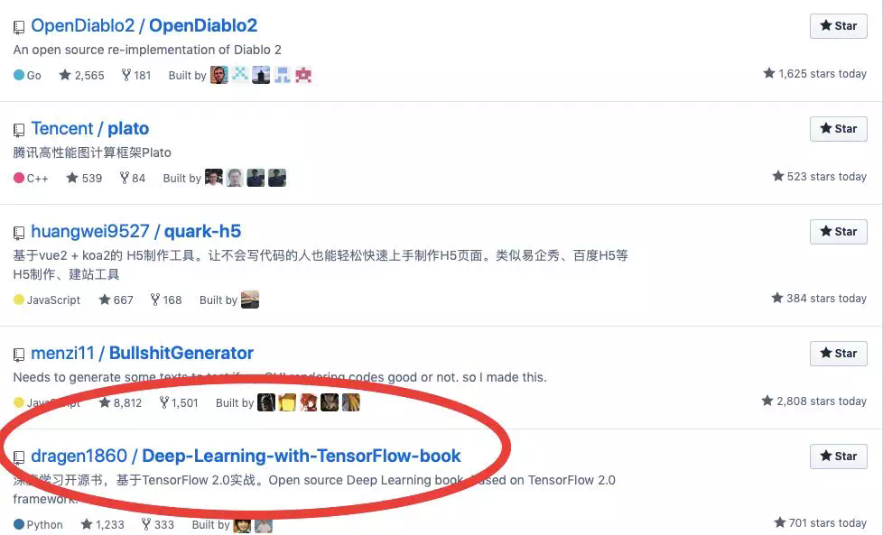
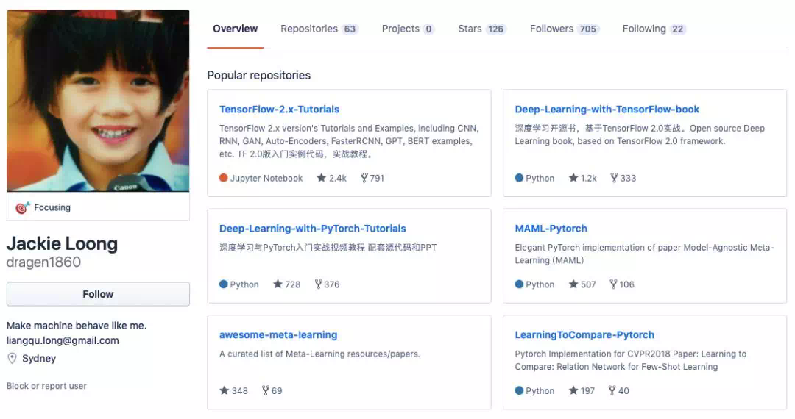
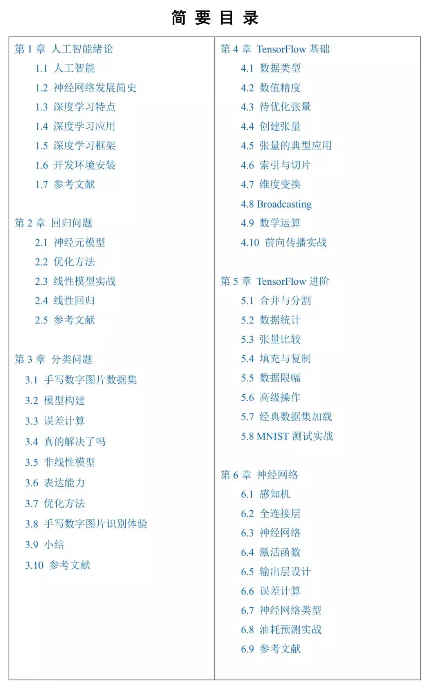
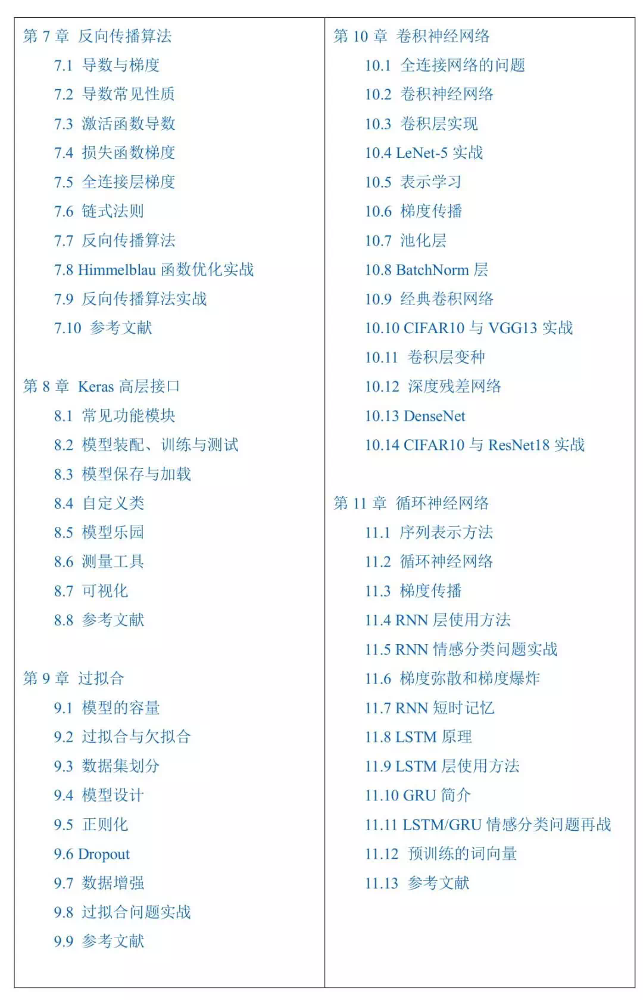

原文：https://www.jiqizhixin.com/articles/2019-11-17-3
# TensorFlow 2.0中文开源书项目：日赞700，登上GitHub热榜
  TensorFlow2.0 正式版已发布一段时间，但目前系统性的相关教程还不够多。这个登上 GitHub 趋势榜的项目今日已获得 
  700 多赞，内容简单易懂，适合初学者和迁移到 tf2.0 的开发者使用。
  
  深度学习中绕不开的便是对算法框架的实际使用了。如果没有娴熟的工程实践能力，很多优秀的算法设计就无法真正使用。
  TensorFlow2.0 正式版已发布了一段时间，然而过去使用 TensorFlow1.x 版本的开发者担心两个版本之间的差距过大以
  至于无法迁移已有的经验，刚入门深度学习的人则因为 TensorFlow 那不友好的 API 和设计逻辑而望而却步。
  
  近日，GitHub 日趋势榜上出现了这样一个中文开源项目。它基于 TensorFlow2.0 框架，有配套学习的书、代码和视频课程，
  非常适合希望了解 tf2.0 的开发者学习参考。
  
  目前该项目已获得了 1000 多的点赞量，登上了 GitHub 热榜，仅在今天项目就获得 700 多赞。



项目地址：https://github.com/dragen1860/Deep-Learning-with-TensorFlow-book

该项目作者为 Jackie Loong（龙良曲），曾为新加坡国立大学助理研究员，有 8 年的人工智能算法经验，在 AAAI 会议上发表过多篇论文。
从他的 GitHub 主页上来看，这位开发者参与了很多深度学习相关的教程项目的工作。

本项目提供了电子版的《TensorFlow 2.0 深度学习开源书》，同时按照章节在每个文件夹中提供了源代码。你只需要下载书籍，并根据内容和源代码进行学习即可。

从章节划分上来看，本书一共分为 15 个章节。首先本书会介绍人工智能的发展历史，然后从第二章开始介绍回归，随后还有分类、TensorFlow 基础和进阶操作、神经网络等知识。在第 10 章以后，书还会介绍包括 CNN、RNN/LSTM、自编码器、GAN 及其变体等多个架构，内容很丰富。

以下为章节目录：



代码部分，目前作者已整理出了除第 4 章以外的大部分代码，目前整理工作还在进行中。

以自编码器的代码为例，作者在 py 文件中详细写出了网络的架构：
```
class AE(keras.Model):

    def __init__(self):
        super(AE, self).__init__()

        # Encoders
        self.encoder = Sequential([
            layers.Dense(256, activation=tf.nn.relu),
            layers.Dense(128, activation=tf.nn.relu),
            layers.Dense(h_dim)
        ])

        # Decoders
        self.decoder = Sequential([
            layers.Dense(128, activation=tf.nn.relu),
            layers.Dense(256, activation=tf.nn.relu),
            layers.Dense(784)
        ])


    def call(self, inputs, training=None):
        # [b, 784] => [b, 10]
        h = self.encoder(inputs)
        # [b, 10] => [b, 784]
        x_hat = self.decoder(h)

        return x_hat
```
同时，每个 py 文件不仅仅只有示例代码。从代码来看，这些 py 文件实际上都是可以直接运行的，以下便是自编码器文件中执行模型训练的代码：
```
model = AE()
model.build(input_shape=(None, 784))
model.summary()

optimizer = tf.optimizers.Adam(lr=lr)

for epoch in range(100):

    for step, x in enumerate(train_db):

        #[b, 28, 28] => [b, 784]
        x = tf.reshape(x, [-1, 784])

        with tf.GradientTape() as tape:
            x_rec_logits = model(x)

            rec_loss = tf.losses.binary_crossentropy(x, x_rec_logits, from_logits=True)
            rec_loss = tf.reduce_mean(rec_loss)

        grads = tape.gradient(rec_loss, model.trainable_variables)
        optimizer.apply_gradients(zip(grads, model.trainable_variables))


        if step % 100 ==0:
            print(epoch, step, float(rec_loss))
```
这样一来，即使没有编程经验的初学者也可以先跑通代码，理解原理后再尝试自行编程。

除了这些资源外，作者还贴出了一个 tf2.0 实战案例的项目库，开发者可配合使用。

项目地址：https://github.com/dragen1860/TensorFlow-2.x-Tutorials

