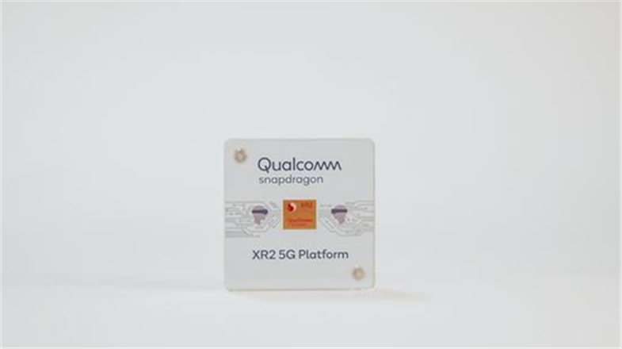
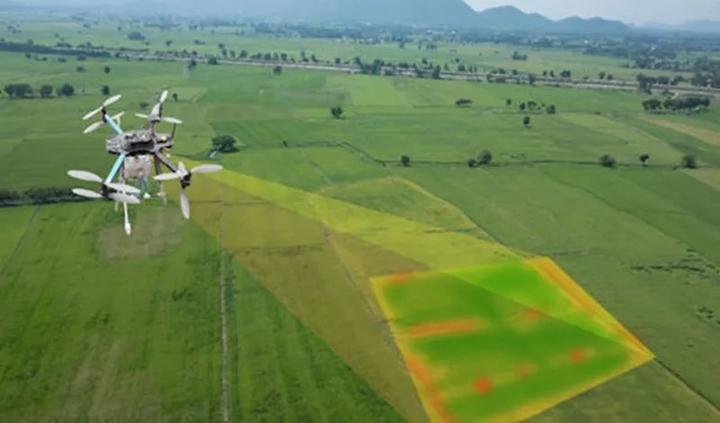
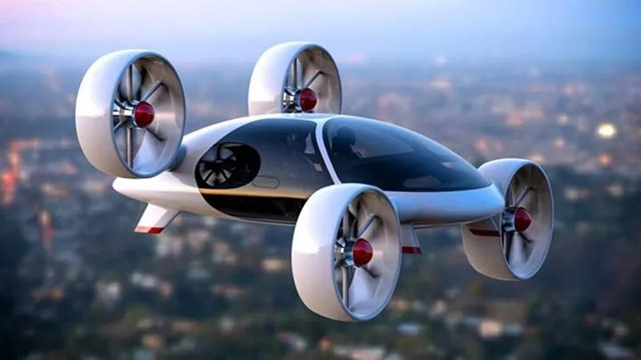
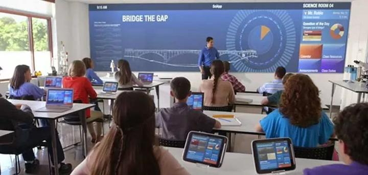
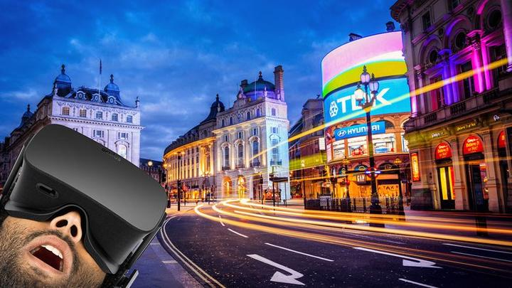

**作者：Nansen**

# 5G互动话题

今年华为引发的5G热潮的爆发，很多新兴的或者以前因为需求达不到的产业，在如今具备条件之后接踵而至。
其提供的技术支持，对于国家走向中国制造2025，人工智能，大数据，云计算，物联网起到推波助澜的作用。
走向国内互联网下一阶段实现万物互联，已经是必然趋势。

自5G商用开始，按照国策，目前最新最热当属物联网和工业方面。
关于巨头行业，最先为华为与三星的争斗已经是老生常谈。
还有一只受到关注的苹果以及高通、英特尔的5G进度方，
苹果则因为自2017年开始与高通斩不断理还乱的专利诉讼选择与英特尔合作。
可惜英特尔进度缓慢，苹果等不急了，这波操作令人有点猝不及防，转脸与高通握手言和再度合作，并且达成了多方面的较长时间合作。
高通5G的研发成功与苹果的合作让苹果加入到争斗当中。

XR2 5G platform of qualcomm for Virtual reality equipment

更加有争议的，高通在12月5日发布之时指出只有支持Sub-6GHz和毫米波双频段的5G基带才是真5G，
旨在暗讽华为余承东曾多次表示“SA/NSA双组网模式的5G才是真5G”的观点。
这番争斗多半会直接影响到两方各自5G相关订单的数量，估计又是一番神仙打架，各有千秋我们不做辩论，
因为技术的产生可以达到同步，但是对技术的应用依托于思想与环境，在技术应用方面达到领先对于目前来讲才是后继杀器。

## 农业

食品和农产品的供应链都将实现数字化，实时数据流将突出消费者偏好的每一次波动与变化。

## 社交

构建新的人际关系一直是一项挑战，特别是当人们发现自己处在陌生环境的陌生人群中时。

## 交通

无人驾驶技术将成为历史上最具破坏性的技术，与汽车行业相关的每项工作都会受到不同程度的影响。
停车场、车库、交通警察、交通法庭、加油站、汽配店、排放测试、驾驶执照、锥形交通路标、称重站、护栏、红绿灯和酒驾监测等都将开始消失。

## 教育

或许有一天互联网上最大的公司将是一家我们从未听说过的教育型公司。

## 零售业

零售商将积极参与全球对话。

## 医疗

## 娱乐

虚拟假期将比真正的假期更放松、更吸引人。

## 工作方面

有偿工作需要与要完成的工作相一致，并且工人需要完成与该工作相匹配的技术培训。5G将是创造新就业机会的重要驱动力。

等等...

企业争端的引申，不论是对于有大民族思潮的中华民族亦或是对于互联网强国之国家良策而言，完全被上升到国家实力的争斗层面。
因而对于其应用显得尤其重要，对于5G应用，若是能够有足够多的天马行空的想法，或许这些方面的争端都将会显得苍白。
套话说尽，不如来点实的，我们是一群思想的狂信徒，热衷于头脑风暴的梦想家，不如就在这里，各位一起头脑风暴起来，发出自己关于5G相关应用的声音，
并将它发散出去，让思维共享起来。

最后希望通过您的一条相关回复表示支持我们。
We are Cynomys！一群妄图推进中国互联网发展的土拨鼠er，期待您的关注与加入。
